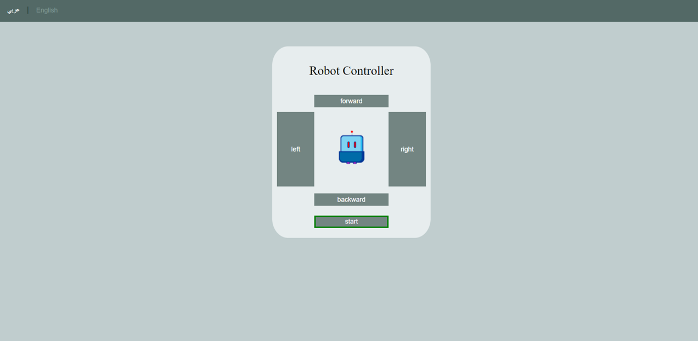
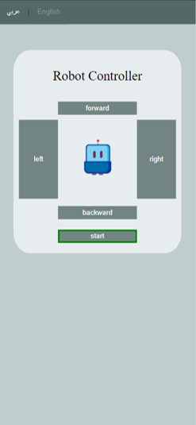
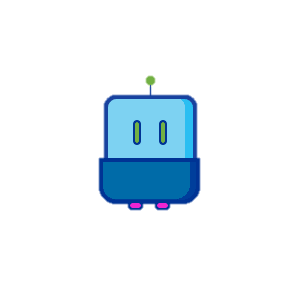
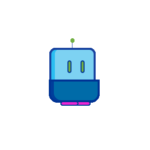
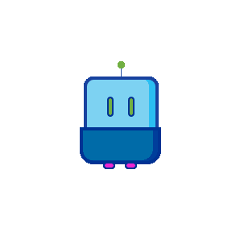

# IOT Task 🗣:

## Description 📄: 
*The aim of this project is to control a robot's move remotely without the need for direct intervention. In order to achieve this, a web interface has been designed to helps the user control the robotic arm. Moreover, this project relied on databases in the process of communication between hardware components and commands sent from a web page by PHP.*

## tools 🛠:
○ HTML  
○ CSS  
○ JavaScript  
○ PHP  
○ MYSQL  

## interface ⭐:
*The interface is designed in a simple way for ease of use.Figure 1 for the large screen and Figure 2 for the mobile web interface (small screen).*

    
    

        figure 1: Interface.
    

     

    
    

        figure 2: Mobile web interface.
    

 
In the interface, the gif and image are used to make the current state of the robot visible to the user. see figure 3,4,5,6,7, and 8

     
    figure 3: Stop state. 
     
    figure 4: Start stat. 
     
    figure 5: Forward move. 
     
    figure 6: Left move. 
     
    figure 7: Right move. 
     
    figure 8: Backward move. 

## database :mag_right: :
*This project only needs to design two tables. One is to save the current state for the robot (Table 1) and the other is to save the last action performed (Table 2).*
 

 Table 1: Moves table.

| Attribute |                   Description                      | Datatype |  PK |
|:---------:|:--------------------------------------------------:|:--------:|:---:|
|    id     |       This id used to determine which robot        |  integer | yes |
|    run    | Used to check whether the robot has started or not |  string  | no  |
|    move   |      Used to store the direction of movement       |  string  | no  |
 

 Table 2: Last move table.

| Attribute |              Description              | Datatype |  PK |
|:---------:|:-------------------------------------:|:--------:|:---:|
|    id     | This id used to determine which tobot |  integer | yes |
|   action  |     Used to store the last action     |  string  | no  |
